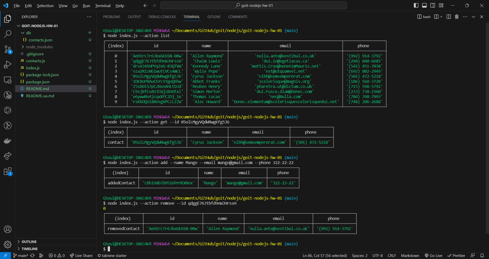

**Read in other languages: [Ukrainian](README.ua.md).**

# CLI application

## Tests and screenshots

```shell
# Get and display the entire list of contacts in the form of a table (console.table)
node index.js --action list

# Get contact by id
node index.js --action get --id 05olLMgyVQdWRwgKfg5J6

# Add the contact
node index.js --action add --name Mango --email mango@gmail.com --phone 322-22-22

# Delete the contact
node index.js --action remove --id qdggE76Jtbfd9eWJHrssH
```


(https://ibb.co/fxgNfgj)

### Step 1

- Initialize npm in the project
- In the root of the project, create a file `index.js`
- Install package [nodemon](https://www.npmjs.com/package/nodemon) as development dependency (devDependencies)
- In `package.json` file add "scripts" to run `index.js`
- `start` script that starts `index.js` with `node`
- `start:dev` script that starts `index.js` with `nodemon`

### Step 2

Created a folder `db` in the root of the project. To store contacts
At the root of the project, created a `contacts.js` file.

- Made imports of modules `fs` and `path` to work with the file system
- Create a `contactsPath` variable and put the path to the `contacts.json` file in it. To compose a path, use the methods of the `path` module
- Add functions to work with a collection of contacts. In functions, use the `fs` module and its `readFile()` and `writeFile()` methods
- Make export of created functions via `module.exports`

### Step 3

Made an import of the `contacts.js` module in the `index.js` file and checked the functionality of the functions for working with contacts.

### Step 4

Used the [commander](https://www.npmjs.com/package/commander) module to parse command line arguments.

```js
const { Command } = require("commander");
const program = new Command();
program
  .option("-a, --action <type>", "choose action")
  .option("-i, --id <type>", "user id")
  .option("-n, --name <type>", "user name")
  .option("-e, --email <type>", "user email")
  .option("-p, --phone <type>", "user phone");

program.parse(process.argv);

const argv = program.opts();

// TODO: refactor
function invokeAction({ action, id, name, email, phone }) {
  switch (action) {
    case "list":
      // ...
      break;

    case "get":
      // ... id
      break;

    case "add":
      // ... name email phone
      break;

    case "remove":
      // ... id
      break;

    default:
      console.warn("\x1B[31m Unknown action type!");
  }
}

invokeAction(argv);
```
